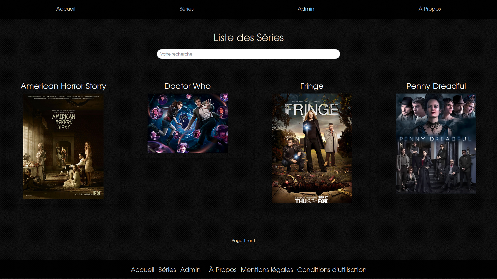

<h1 align="center">Projet fictif n° 2</h1> 
<h2 align="center">Alphaseries : Site de gestion de séries</h2> 

<h2>Description</h2>

Application de gestion de séries TV : Alphaseries.

Liste des fonctionnalités : 

<ul>
  <li>création de séries et épisodes</li>
  <li>Système de gestion des épisodes vus ou non</li>
  <li>Système de notation des séries</li>
</ul>

L'application est composé des pages suivantes :

<ul>
  <li>Accueil</li>
  <li>Séries</li>
  <li>Admin</li>
  <li>À propos</li>
</ul>
<h2>Technologies utilisées</h2>
<ul>
  <li>Bootstrap v4.0</li>
  <li>PHP v7.1</li>
</ul>
<h2>Installation</h2>
<ul>
  <li>Cloner le repository github dans un nouveau dossier</li>
  <li>Créer une connexion en local pour afficher le projet sur le navigateur</li>
</ul>
<h2>Credits</h2>
Ce projet est un travail de groupe dans le cadre de la formation développement web et mobile de la Wild code school Orléans.
Merci à :
<ul>
  <li>Edwin Gerard</li>
  <li>Julien Hoste</li>
  <li>Maxime Goyard</li>
  <li>Thomas Essoungou</li>
</ul>
